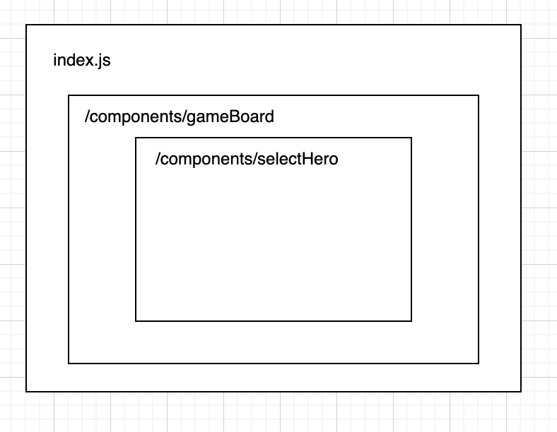

## Getting Started

### installation

Татаж авсны дараа доорх командыг зөвхөн нэг удаа ажиллуулна. Дахиж ажиллуулах шаардлагагүй.

```bash
npm i
```

### Run

```bash
npm run dev
```

### Task

Даалгавар хийхийн өмнө javascript -н array дээрх prototype-н нэг болох map() гэсэн функцийг харах хэрэгтэй.

map(x => ...) // ... оронд x буюу жагсаалтын нэг элементийг хэрхэн хувиргахаа бичнэ
map((x, i) => ...) // ... x нь нэг элемент, i нь индекс юм

1. `/src/components/selectHero.js` component доторх баатруудын нэрийг харуулах.
   жич: hover хийх үед харуулж болно. эсвэл байнга харагдаж байсан ч болно.


